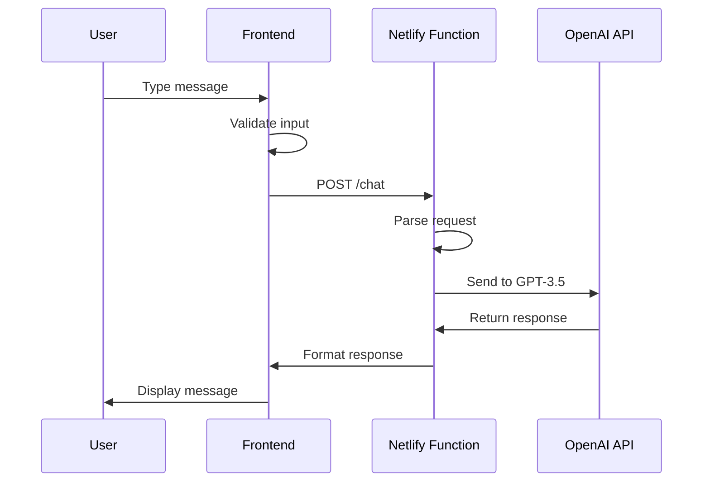
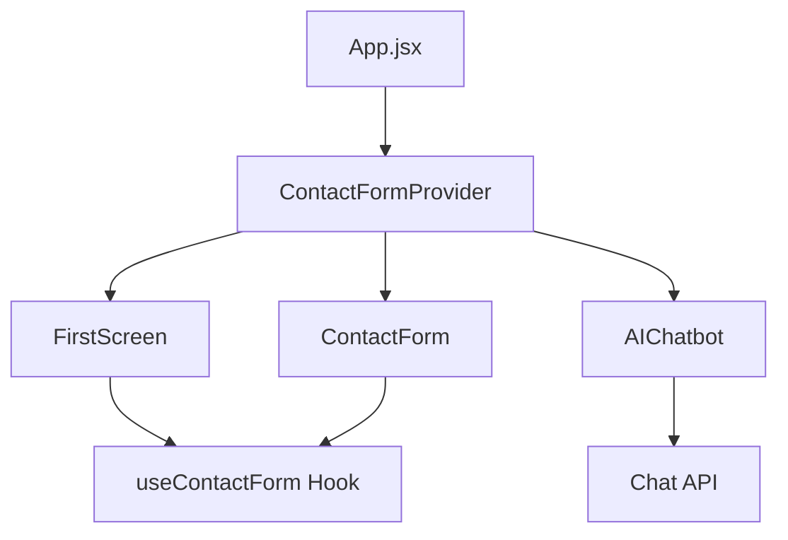

# ResistWise - AI-Powered AMR Management Platform

<div align="center">
  
  <h1>ResistWise</h1>
  <p><strong>AI-Powered Precision Antibiotic Prescriptions</strong></p>
  <p>Fighting Antimicrobial Resistance (AMR) in Real-Time</p>
  
  [](https://react.dev/)
  [](https://vitejs.dev/)
  [](https://netlify.com/)
  [](https://openai.com/)
  
  [Live Demo](https://resistwise-landing.netlify.app/) • [Documentation](./docs/) • [API Reference](./docs/api.md)
</div>

##  Project Overview

ResistWise is a comprehensive web platform designed to combat Antimicrobial Resistance (AMR) by providing AI-powered precision antibiotic prescriptions. The platform helps healthcare professionals make informed decisions about antibiotic usage through real-time resistance data and intelligent recommendations.

### Key Features
- 🤖 **AI-Powered Chatbot**: Real-time assistance for AMR-related queries
- 📊 **Risk Calculator**: Interactive tool for assessing AMR risk factors
- 🎨 **Modern UI/UX**: Responsive design with smooth animations
- 🔒 **Secure API Integration**: Serverless functions with OpenAI GPT-3.5
- 📱 **Mobile-First Design**: Optimized for all device sizes
- ⚡ **Performance Optimized**: Fast loading with Vite and modern React

## 🚀 Tech Stack

### Frontend
- **React 19.1.0** - Latest React with concurrent features
- **Vite 6.3.5** - Lightning-fast build tool and dev server
- **Emotion** - CSS-in-JS styling solution
- **Custom Fonts** - Arial Rounded MT Bold & SF Compact Rounded

### Backend & APIs
- **Netlify Functions** - Serverless backend
- **OpenAI GPT-3.5 Turbo** - AI-powered chatbot
- **RESTful API** - Clean API design

### Development Tools
- **ESLint** - Code quality and consistency
- **Git** - Version control
- **Netlify** - Deployment and hosting

## 📁 Project Structure

```
resistwise_landing/
├── src/
│   ├── components/          # React components
│   │   ├── FirstScreen.jsx  # Hero section with navigation
│   │   ├── AMRCrisis.jsx    # AMR information section
│   │   ├── HowItWorks.jsx   # Process explanation
│   │   ├── KeyAdvantages.jsx # Feature highlights
│   │   ├── LastScreen.jsx   # Contact and footer
│   │   ├── AIChatbot.jsx    # AI-powered chatbot
│   │   ├── ContactForm.jsx  # Contact form modal
│   │   └── RiskCalculator.jsx # Interactive risk assessment
│   ├── context/             # React Context for state management
│   │   └── ContactFormContext.jsx
│   ├── styles/              # CSS files
│   ├── assets/              # Images and SVGs
│   └── fonts/               # Custom font files
├── netlify/
│   └── functions/           # Serverless functions
│       └── chat.js          # OpenAI API integration
├── public/                  # Static assets
├── docs/                    # Documentation
└── package.json
```

## ️ Getting Started

### Prerequisites
- Node.js 18+ 
- npm or yarn
- OpenAI API key

### Installation

1. **Clone the repository**
   ```bash
   git clone https://github.com/yourusername/resistwise_landing.git
   cd resistwise_landing
   ```

2. **Install dependencies**
   ```bash
   npm install
   ```

3. **Set up environment variables**
   ```bash
   # Create .env file
   echo "OPENAI_API_KEY=your_openai_api_key_here" > .env
   ```

4. **Start development server**
   ```bash
   npm run dev
   ```

5. **Open your browser**
   Navigate to `http://localhost:5173`

### Production Deployment

1. **Deploy to Netlify**
   ```bash
   # Install Netlify CLI
   npm install -g netlify-cli
   
   # Login and deploy
   netlify login
   netlify deploy --prod
   ```

2. **Set environment variables in Netlify Dashboard**
   - Go to Site Settings > Environment Variables
   - Add `OPENAI_API_KEY` with your API key

##  Design System

### Color Palette
- **Primary Blue**: `#00A1FF` - Trust and medical professionalism
- **Secondary Purple**: `#8c1aff` - Innovation and technology
- **Background**: `#F9FAFF` - Clean, medical-grade white
- **Text**: `#1a1a1a` - High contrast for accessibility

### Typography
- **Headings**: Arial Rounded MT Bold - Professional and approachable
- **Body**: SF Compact Rounded - Modern and readable

### Components
- **Buttons**: Rounded with gradient backgrounds and hover effects
- **Cards**: Subtle shadows with rounded corners
- **Forms**: Clean inputs with focus states
- **Modals**: Backdrop blur with smooth animations

## 🤖 AI Chatbot Features

The AI chatbot is powered by OpenAI's GPT-3.5 Turbo and provides:

- **Contextual Responses**: Maintains conversation history
- **AMR Expertise**: Specialized knowledge in antimicrobial resistance
- **Russian Language Support**: Full localization
- **Real-time Processing**: Instant responses with typing indicators
- **Error Handling**: Graceful fallbacks for API issues

### Chatbot Architecture
```javascript
// System prompt for specialized AMR knowledge
const systemPrompt = `Ты - помощник по вопросам антимикробной резистентности (AMR)...`;

// Serverless function handling
exports.handler = async function(event, context) {
  // CORS handling, input validation, OpenAI API integration
};
```

## 📊 Risk Calculator

Interactive tool for assessing AMR risk factors:

- **Age-based Assessment**: Different risk levels by age group
- **Symptom Analysis**: Severity-based risk calculation
- **Geographic Factors**: Region-specific resistance patterns
- **Medical History**: Previous antibiotic usage impact
- **Hospital Exposure**: Healthcare-associated risks

## 🔧 API Documentation

### Chat Endpoint
```http
POST /.netlify/functions/chat
Content-Type: application/json

{
  "message": "string",
  "conversationHistory": [
    {
      "text": "string",
      "isBot": boolean,
      "timestamp": "ISO string"
    }
  ]
}
```

**Response:**
```json
{
  "response": "AI-generated response in Russian"
}
```

## 🚀 Performance Optimizations

### Frontend
- **Code Splitting**: Lazy loading for heavy components
- **Image Optimization**: Optimized SVGs and webp formats
- **Font Loading**: `font-display: swap` for better performance
- **CSS Optimization**: Critical CSS inlined, rest loaded asynchronously

### Backend
- **Serverless Functions**: Pay-per-use, auto-scaling
- **Caching**: Response caching for common queries
- **Error Handling**: Graceful degradation

## 📱 Responsive Design

The application is fully responsive with breakpoints:
- **Mobile**: < 768px
- **Tablet**: 768px - 1024px  
- **Desktop**: > 1024px

### Mobile Optimizations
- Touch-friendly interface
- Optimized navigation
- Reduced animations for better performance
- Simplified layouts for small screens

## 🔒 Security Considerations

- **API Key Protection**: Environment variables only
- **Input Validation**: Server-side validation for all inputs
- **CORS Configuration**: Proper cross-origin resource sharing
- **Rate Limiting**: Built into OpenAI API
- **HTTPS Only**: Secure connections in production

##  Testing Strategy

### Manual Testing
- Cross-browser compatibility (Chrome, Firefox, Safari, Edge)
- Mobile device testing (iOS, Android)
- Accessibility testing (screen readers, keyboard navigation)

### Performance Testing
- Lighthouse audits
- Core Web Vitals monitoring
- Load time optimization

## 📈 Analytics & Monitoring

- **Error Tracking**: Console logging for debugging
- **Performance Monitoring**: Built-in browser dev tools
- **User Analytics**: Ready for Google Analytics integration

## 🔄 Development Workflow

1. **Feature Development**: Create feature branches
2. **Code Review**: Pull request reviews
3. **Testing**: Manual and automated testing
4. **Deployment**: Automatic deployment to staging
5. **Production**: Manual deployment to production

## 🤝 Contributing

1. Fork the repository
2. Create a feature branch (`git checkout -b feature/amazing-feature`)
3. Commit your changes (`git commit -m 'Add amazing feature'`)
4. Push to the branch (`git push origin feature/amazing-feature`)
5. Open a Pull Request

## 📄 License

This project is licensed under the MIT License - see the [LICENSE](LICENSE) file for details.

##  Acknowledgments

- **OpenAI** for providing the GPT-3.5 API
- **Netlify** for hosting and serverless functions
- **React Team** for the amazing framework
- **Vite Team** for the fast build tool

## 📞 Contact

- **Project Link**: [https://github.com/yourusername/resistwise_landing](https://github.com/yourusername/resistwise_landing)
- **Live Demo**: [https://resistwise-landing.netlify.app/](https://resistwise-landing.netlify.app/)
- **Email**: your.email@example.com

---

<div align="center">
  <p>Made with ❤️ for better healthcare</p>
  <p>Fighting AMR, one prescription at a time</p>
</div>

```markdown:docs/API.md
# API Documentation

## Overview

The ResistWise API provides AI-powered chat functionality for antimicrobial resistance (AMR) queries. The API is built using Netlify Functions and integrates with OpenAI's GPT-3.5 Turbo model.

## Base URL

```
https://your-site.netlify.app/.netlify/functions
```

## Authentication

The API uses OpenAI API key authentication, which is handled server-side through environment variables.

## Endpoints

### Chat Endpoint

**POST** `/chat`

Sends a message to the AI chatbot and receives a contextual response.

#### Request Headers

```
Content-Type: application/json
```

#### Request Body

```json
{
  "message": "string (required)",
  "conversationHistory": [
    {
      "text": "string",
      "isBot": boolean,
      "timestamp": "ISO string"
    }
  ]
}
```

#### Parameters

| Parameter | Type | Required | Description |
|-----------|------|----------|-------------|
| `message` | string | Yes | The user's message |
| `conversationHistory` | array | No | Previous conversation messages for context |

#### Response

**Success (200)**
```json
{
  "response": "AI-generated response in Russian"
}
```

**Error Responses**

**400 Bad Request**
```json
{
  "error": "Message is required and must be a string"
}
```

**401 Unauthorized**
```json
{
  "error": "Ошибка аутентификации API",
  "details": "Invalid API key"
}
```

**429 Too Many Requests**
```json
{
  "error": "Превышен лимит запросов. Попробуйте позже.",
  "details": "API quota exceeded"
}
```

**500 Internal Server Error**
```json
{
  "error": "Произошла ошибка при обработке запроса",
  "details": "Error details"
}
```

#### Example Usage

```javascript
const response = await fetch('/.netlify/functions/chat', {
  method: 'POST',
  headers: {
    'Content-Type': 'application/json',
  },
  body: JSON.stringify({
    message: 'Что такое антимикробная резистентность?',
    conversationHistory: []
  })
});

const data = await response.json();
console.log(data.response);
```

## Error Handling

### Common Error Codes

| Code | Description | Solution |
|------|-------------|----------|
| 400 | Invalid request format | Check request body structure |
| 401 | API key not configured | Set OPENAI_API_KEY environment variable |
| 429 | Rate limit exceeded | Wait before making more requests |
| 500 | Server error | Check server logs for details |

### Best Practices

1. **Always handle errors gracefully**
2. **Implement retry logic for 429 errors**
3. **Cache responses when appropriate**
4. **Validate input before sending**

## Rate Limiting

The API is subject to OpenAI's rate limits:
- 3,500 requests per minute for GPT-3.5 Turbo
- Implement exponential backoff for retries

## CORS

The API supports CORS and allows requests from any origin:

```
Access-Control-Allow-Origin: *
Access-Control-Allow-Methods: GET, POST, OPTIONS
Access-Control-Allow-Headers: Content-Type
```

## Testing

### Test Endpoint

**GET** `/test`

Returns a simple test response to verify the function is working.

**Response:**
```json
{
  "message": "Function is working!",
  "timestamp": "2024-01-01T00:00:00.000Z"
}
```

### Local Testing

```bash
# Install Netlify CLI
npm install -g netlify-cli

# Start local development
netlify dev

# Test the endpoint
curl -X POST http://localhost:8888/.netlify/functions/chat \
  -H "Content-Type: application/json" \
  -d '{"message":"test"}'
```

```markdown:docs/DEPLOYMENT.md
# Deployment Guide

## Overview

This guide covers deploying the ResistWise application to production using Netlify, including environment setup, CI/CD configuration, and monitoring.

## Prerequisites

- Netlify account
- OpenAI API key
- Git repository with your code

## Deployment Options

### Option 1: Netlify (Recommended)

#### Step 1: Connect Repository

1. **Login to Netlify**
   - Go to [app.netlify.com](https://app.netlify.com)
   - Sign in with your GitHub account

2. **Create New Site**
   - Click "New site from Git"
   - Choose your repository
   - Select the main branch

#### Step 2: Configure Build Settings

**Build command:**
```bash
npm run build
```

**Publish directory:**
```
dist
```

**Functions directory:**
```
netlify/functions
```

#### Step 3: Environment Variables

1. **Go to Site Settings**
   - Navigate to your site dashboard
   - Click "Site settings"

2. **Add Environment Variables**
   - Click "Environment variables"
   - Add the following:

| Variable | Value | Description |
|----------|-------|-------------|
| `OPENAI_API_KEY` | `sk-...` | Your OpenAI API key |

#### Step 4: Deploy

1. **Trigger Deployment**
   - Push changes to your main branch
   - Netlify will automatically deploy

2. **Verify Deployment**
   - Check the deploy logs
   - Test the live site

### Option 2: Vercel

#### Step 1: Install Vercel CLI

```bash
npm install -g vercel
```

#### Step 2: Configure Project

Create `vercel.json`:
```json
{
  "functions": {
    "api/chat.js": {
      "runtime": "nodejs18.x"
    }
  },
  "env": {
    "OPENAI_API_KEY": "@openai_api_key"
  }
}
```

#### Step 3: Deploy

```bash
vercel --prod
```

## Environment Configuration

### Development

Create `.env` file:
```env
OPENAI_API_KEY=your_openai_api_key_here
```

### Production

Set environment variables in your hosting platform:

**Netlify:**
- Site Settings → Environment Variables

**Vercel:**
- Project Settings → Environment Variables

## CI/CD Pipeline

### GitHub Actions (Optional)

Create `.github/workflows/deploy.yml`:

```yaml
name: Deploy to Netlify

on:
  push:
    branches: [ main ]

jobs:
  deploy:
    runs-on: ubuntu-latest
    steps:
    - uses: actions/checkout@v2
    
    - name: Setup Node.js
      uses: actions/setup-node@v2
      with:
        node-version: '18'
        
    - name: Install dependencies
      run: npm ci
      
    - name: Build
      run: npm run build
      
    - name: Deploy to Netlify
      uses: nwtgck/actions-netlify@v1.2
      with:
        publish-dir: './dist'
        production-branch: main
        github-token: ${{ secrets.GITHUB_TOKEN }}
        deploy-message: "Deploy from GitHub Actions"
      env:
        NETLIFY_AUTH_TOKEN: ${{ secrets.NETLIFY_AUTH_TOKEN }}
        NETLIFY_SITE_ID: ${{ secrets.NETLIFY_SITE_ID }}
```

## Domain Configuration

### Custom Domain

1. **Add Custom Domain**
   - Go to Site Settings → Domain management
   - Click "Add custom domain"
   - Enter your domain

2. **DNS Configuration**
   - Add CNAME record pointing to your Netlify site
   - Wait for DNS propagation

### SSL Certificate

- Netlify provides automatic SSL certificates
- Certificates are renewed automatically

## Monitoring & Analytics

### Performance Monitoring

1. **Core Web Vitals**
   - Monitor in Google Search Console
   - Use Lighthouse for audits

2. **Error Tracking**
   - Check Netlify function logs
   - Monitor browser console errors

### Analytics Setup

Add Google Analytics:

```html
<!-- In index.html -->
<script async src="https://www.googletagmanager.com/gtag/js?id=GA_MEASUREMENT_ID"></script>
<script>
  window.dataLayer = window.dataLayer || [];
  function gtag(){dataLayer.push(arguments);}
  gtag('js', new Date());
  gtag('config', 'GA_MEASUREMENT_ID');
</script>
```

## Troubleshooting

### Common Issues

**Function Not Found (404)**
- Check functions directory in `netlify.toml`
- Verify function file exists
- Check deployment logs

**API Key Error (502)**
- Verify environment variable is set
- Check API key format
- Ensure key has proper permissions

**Build Failures**
- Check Node.js version compatibility
- Verify all dependencies are installed
- Review build logs for errors

### Debug Commands

```bash
# Test functions locally
netlify dev

# Check function logs
netlify functions:list

# View deployment status
netlify status
```

## Security Best Practices

1. **Environment Variables**
   - Never commit API keys to Git
   - Use different keys for dev/prod
   - Rotate keys regularly

2. **CORS Configuration**
   - Restrict origins in production
   - Validate all inputs
   - Implement rate limiting

3. **HTTPS Only**
   - Force HTTPS redirects
   - Use secure cookies
   - Validate SSL certificates

## Performance Optimization

### Build Optimization

1. **Code Splitting**
   - Lazy load components
   - Split vendor bundles
   - Optimize images

2. **Caching**
   - Set appropriate cache headers
   - Use CDN for static assets
   - Implement service workers

### Runtime Optimization

1. **Bundle Size**
   - Monitor bundle size
   - Remove unused dependencies
   - Use tree shaking

2. **Loading Performance**
   - Optimize critical rendering path
   - Minimize blocking resources
   - Use preloading strategies

## Backup & Recovery

### Database Backup

- No database in this project
- Consider backing up environment variables
- Document configuration settings

### Disaster Recovery

1. **Code Backup**
   - Use Git for version control
   - Maintain multiple branches
   - Document deployment procedures

2. **Configuration Backup**
   - Export environment variables
   - Document all settings
   - Maintain deployment scripts
```

```markdown:docs/ARCHITECTURE.md
# Architecture Documentation

## System Overview

ResistWise is a modern web application built with a microservices architecture, leveraging serverless functions for backend processing and a React-based frontend for user interaction.

## Architecture Diagram

```
┌─────────────────┐    ┌──────────────────┐    ┌─────────────────┐
│   User Browser  │    │   Netlify CDN    │    │  OpenAI API     │
│                 │    │                  │    │                 │
│  React App      │◄──►│  Static Assets   │    │  GPT-3.5 Turbo  │
│  (Frontend)     │    │  (HTML/CSS/JS)   │    │                 │
└─────────────────┘    └──────────────────┘    └─────────────────┘
         │                       │                       ▲
         │                       │                       │
         ▼                       ▼                       │
┌─────────────────┐    ┌──────────────────┐              │
│  Netlify        │    │  Environment     │              │
│  Functions      │    │  Variables       │              │
│  (Backend)      │    │  (API Keys)      │              │
└─────────────────┘    └──────────────────┘              │
         │                                               │
         └───────────────────────────────────────────────┘
```

## Frontend Architecture

### Component Structure

```
App.jsx
├── FirstScreen.jsx (Hero Section)
├── AMRCrisis.jsx (Information Section)
├── HowItWorks.jsx (Process Flow)
├── KeyAdvantages.jsx (Features)
├── LastScreen.jsx (Contact/Footer)
├── AIChatbot.jsx (AI Assistant)
└── ContactForm.jsx (Modal Form)
```

### State Management

**Context API Pattern**
```javascript
// ContactFormContext.jsx
const ContactFormContext = createContext();

export const ContactFormProvider = ({ children }) => {
  const [isContactFormOpen, setIsContactFormOpen] = useState(false);
  
  const openContactForm = () => setIsContactFormOpen(true);
  const closeContactForm = () => setIsContactFormOpen(false);
  
  return (
    <ContactFormContext.Provider value={{
      isContactFormOpen,
      openContactForm,
      closeContactForm,
    }}>
      {children}
    </ContactFormContext.Provider>
  );
};
```

### Styling Architecture

**CSS-in-JS with Emotion**
- Component-scoped styles
- Dynamic styling based on props
- Theme consistency across components

**Custom Fonts**
- Arial Rounded MT Bold for headings
- SF Compact Rounded for body text
- Optimized font loading with `font-display: swap`

## Backend Architecture

### Serverless Functions

**Function Structure**
```javascript
<code_block_to_apply_changes_from>
```

**Request Flow**
1. **Client Request** → Netlify Function
2. **Input Validation** → Sanitize and validate
3. **OpenAI API Call** → Process with GPT-3.5
4. **Response Formatting** → Structure response
5. **Client Response** → Return to frontend

### API Design

**RESTful Principles**
- Stateless operations
- Standard HTTP methods
- Consistent response format
- Proper error handling

**Response Format**
```json
{
  "response": "string",
  "error": "string (optional)",
  "details": "string (optional)"
}
```

## Data Flow

### Chat Flow



### Component Communication



## Security Architecture

### Authentication & Authorization

**API Key Management**
- Environment variables for sensitive data
- Server-side only API key storage
- No client-side exposure of secrets

**Input Validation**
```javascript
// Server-side validation
if (!message || typeof message !== 'string') {
  return {
    statusCode: 400,
    body: JSON.stringify({ error: 'Invalid input' })
  };
}
```

### CORS Configuration

**Cross-Origin Resource Sharing**
```javascript
const headers = {
  'Access-Control-Allow-Origin': '*',
  'Access-Control-Allow-Methods': 'GET, POST, OPTIONS',
  'Access-Control-Allow-Headers': 'Content-Type'
};
```

## Performance Architecture

### Frontend Optimization

**Code Splitting**
```javascript
// Lazy loading for heavy components
const RiskCalculator = lazy(() => import('./components/RiskCalculator'));
const Chatbot = lazy(() => import('./components/Chatbot'));
```

**Image Optimization**
- SVG icons for scalability
- Optimized image formats
- Lazy loading for images

**Font Optimization**
```css
@font-face {
  font-family: 'Arial Rounded MT Bold';
  font-display: swap; /* Prevents FOIT */
}
```

### Backend Optimization

**Serverless Benefits**
- Auto-scaling based on demand
- Pay-per-use pricing
- No server maintenance

**Caching Strategy**
- Browser caching for static assets
- CDN distribution for global performance
- Response caching for common queries

## Scalability Considerations

### Horizontal Scaling

**Frontend**
- CDN distribution
- Static asset optimization
- Client-side caching

**Backend**
- Serverless auto-scaling
- Function isolation
- Stateless design

### Vertical Scaling

**Performance Monitoring**
- Core Web Vitals tracking
- Function execution time monitoring
- Error rate tracking

## Error Handling

### Frontend Error Handling

**React Error Boundaries**
```javascript
class ErrorBoundary extends React.Component {
  constructor(props) {
    super(props);
    this.state = { hasError: false };
  }

  static getDerivedStateFromError(error) {
    return { hasError: true };
  }

  render() {
    if (this.state.hasError) {
      return <h1>Something went wrong.</h1>;
    }
    return this.props.children;
  }
}
```

### Backend Error Handling

**Graceful Degradation**
```javascript
try {
  const completion = await openai.chat.completions.create({
    // API call
  });
} catch (error) {
  // Handle specific error types
  if (error.code === 'insufficient_quota') {
    return { statusCode: 429, body: JSON.stringify({ error: 'Rate limit exceeded' }) };
  }
  // Generic error handling
  return { statusCode: 500, body: JSON.stringify({ error: 'Internal server error' }) };
}
```

## Monitoring & Observability

### Logging Strategy

**Frontend Logging**
- Console logging for development
- Error tracking for production
- Performance monitoring

**Backend Logging**
- Function execution logs
- API response times
- Error rate monitoring

### Metrics Collection

**Key Performance Indicators**
- Page load time
- Function response time
- Error rates
- User engagement metrics

## Future Architecture Considerations

### Potential Improvements

1. **TypeScript Migration**
   - Type safety
   - Better developer experience
   - Reduced runtime errors

2. **State Management**
   - Redux Toolkit for complex state
   - Persistence layer
   - Offline support

3. **Testing Infrastructure**
   - Unit tests with Jest
   - Integration tests
   - E2E tests with Playwright

4. **CI/CD Pipeline**
   - Automated testing
   - Staging environment
   - Blue-green deployments

5. **Microservices Expansion**
   - User authentication service
   - Analytics service
   - Notification service
```

```markdown:docs/CONTRIBUTING.md
# Contributing to ResistWise

Thank you for your interest in contributing to ResistWise! This document provides guidelines and information for contributors.

## Table of Contents

- [Code of Conduct](#code-of-conduct)
- [Getting Started](#getting-started)
- [Development Setup](#development-setup)
- [Coding Standards](#coding-standards)
- [Testing](#testing)
- [Pull Request Process](#pull-request-process)
- [Reporting Bugs](#reporting-bugs)
- [Feature Requests](#feature-requests)

## Code of Conduct

### Our Pledge

We as members, contributors, and leaders pledge to make participation in our community a harassment-free experience for everyone, regardless of age, body size, visible or invisible disability, ethnicity, sex characteristics, gender identity and expression, level of experience, education, socio-economic status, nationality, personal appearance, race, religion, or sexual identity and orientation.

### Our Standards

Examples of behavior that contributes to a positive environment for our community include:

- Using welcoming and inclusive language
- Being respectful of differing opinions, viewpoints, and experiences
- Gracefully accepting constructive criticism
- Focusing on what is best for the community
- Showing empathy towards other community members

Examples of unacceptable behavior include:

- The use of sexualized language or imagery, and sexual attention or advances
- Trolling, insulting or derogatory comments, and personal or political attacks
- Public or private harassment
- Publishing others' private information without explicit permission
- Other conduct which could reasonably be considered inappropriate

## Getting Started

### Prerequisites

- Node.js 18+ 
- npm or yarn
- Git
- Code editor (VS Code recommended)

### Fork and Clone

1. **Fork the repository**
   - Go to the main repository page
   - Click the "Fork" button in the top right

2. **Clone your fork**
   ```bash
   git clone https://github.com/yourusername/resistwise_landing.git
   cd resistwise_landing
   ```

3. **Add upstream remote**
   ```bash
   git remote add upstream https://github.com/original-owner/resistwise_landing.git
   ```

## Development Setup

### Installation

1. **Install dependencies**
   ```bash
   npm install
   ```

2. **Set up environment variables**
   ```bash
   cp .env.example .env
   # Edit .env with your OpenAI API key
   ```

3. **Start development server**
   ```bash
   npm run dev
   ```

### Available Scripts

| Script | Description |
|--------|-------------|
| `npm run dev` | Start development server |
| `npm run build` | Build for production |
| `npm run preview` | Preview production build |
| `npm run lint` | Run ESLint |
| `npm run lint:fix` | Fix ESLint errors |

## Coding Standards

### JavaScript/React Standards

**Component Structure**
```javascript
import React, { useState, useEffect } from 'react';
import './ComponentName.css';

const ComponentName = ({ prop1, prop2 }) => {
  // Hooks at the top
  const [state, setState] = useState(initialValue);
  
  // Effects after hooks
  useEffect(() => {
    // Effect logic
  }, [dependencies]);
  
  // Event handlers
  const handleClick = () => {
    // Handler logic
  };
  
  // Render
  return (
    <div className="component-name">
      {/* JSX */}
    </div>
  );
};

export default ComponentName;
```

**Naming Conventions**
- Components: PascalCase (`ComponentName`)
- Files: PascalCase for components, camelCase for utilities
- Variables: camelCase (`variableName`)
- Constants: UPPER_SNAKE_CASE (`CONSTANT_NAME`)
- CSS classes: kebab-case (`component-name`)

### CSS Standards

**File Organization**
```css
/* 1. Font imports */
@font-face { ... }

/* 2. CSS custom properties */
:root { ... }

/* 3. Base styles */
* { ... }
body { ... }

/* 4. Component styles */
.component-name { ... }

/* 5. Media queries */
@media (max-width: 768px) { ... }
```

**Naming Conventions**
- Use BEM methodology for complex components
- Keep class names descriptive and semantic
- Avoid deep nesting (max 3 levels)

### Git Standards

**Commit Messages**
```
type(scope): description

feat(chatbot): add typing indicator
fix(navigation): resolve mobile menu issue
docs(readme): update installation instructions
style(buttons): improve hover effects
refactor(api): simplify error handling
test(calculator): add unit tests
```

**Branch Naming**
```
feature/chatbot-enhancements
fix/navigation-bug
docs/api-documentation
refactor/state-management
```

## Testing

### Testing Strategy

**Unit Tests**
- Test individual components
- Test utility functions
- Test API functions

**Integration Tests**
- Test component interactions
- Test API integration
- Test user workflows

**E2E Tests**
- Test complete user journeys
- Test cross-browser compatibility
- Test responsive design

### Writing Tests

**Component Test Example**
```javascript
import { render, screen, fireEvent } from '@testing-library/react';
import AIChatbot from '../AIChatbot';

describe('AIChatbot', () => {
  test('renders chat button', () => {
    render(<AIChatbot />);
    expect(screen.getByLabelText('Открыть чат')).toBeInTheDocument();
  });

  test('opens chat window on button click', () => {
    render(<AIChatbot />);
    const button = screen.getByLabelText('Открыть чат');
    fireEvent.click(button);
    expect(screen.getByText('ResistWise Assistant')).toBeInTheDocument();
  });
});
```

### Running Tests

```bash
# Run all tests
npm test

# Run tests in watch mode
npm test -- --watch

# Run tests with coverage
npm test -- --coverage
```

## Pull Request Process

### Before Submitting

1. **Update your fork**
   ```bash
   git fetch upstream
   git checkout main
   git merge upstream/main
   ```

2. **Create a feature branch**
   ```bash
   git checkout -b feature/your-feature-name
   ```

3. **Make your changes**
   - Follow coding standards
   - Write tests for new features
   - Update documentation

4. **Test your changes**
   ```bash
   npm run lint
   npm test
   npm run build
   ```

### Submitting a PR

1. **Push your branch**
   ```bash
   git push origin feature/your-feature-name
   ```

2. **Create Pull Request**
   - Go to your fork on GitHub
   - Click "New Pull Request"
   - Select your feature branch

3. **Fill out PR template**
   - Describe your changes
   - Link related issues
   - Add screenshots if applicable

### PR Review Process

1. **Automated Checks**
   - Linting passes
   - Tests pass
   - Build succeeds

2. **Code Review**
   - At least one approval required
   - Address review comments
   - Update PR as needed

3. **Merge**
   - Squash commits if requested
   - Delete feature branch after merge

## Reporting Bugs

### Bug Report Template

**Title**: Brief description of the issue

**Description**: Detailed explanation of the problem

**Steps to Reproduce**:
1. Go to '...'
2. Click on '...'
3. Scroll down to '...'
4. See error

**Expected Behavior**: What should happen

**Actual Behavior**: What actually happens

**Environment**:
- OS: [e.g. Windows 10]
- Browser: [e.g. Chrome 91]
- Version: [e.g. 1.0.0]

**Additional Context**: Any other information

### Before Reporting

1. **Check existing issues** - Search for similar problems
2. **Test in different browsers** - Verify it's not browser-specific
3. **Clear cache and cookies** - Ensure it's not a caching issue
4. **Try incognito mode** - Rule out extension interference

## Feature Requests

### Feature Request Template

**Title**: Brief description of the feature

**Problem Statement**: What problem does this solve?

**Proposed Solution**: How should it work?

**Alternative Solutions**: Other approaches considered

**Additional Context**: Screenshots, mockups, etc.

### Before Requesting

1. **Check existing features** - Make sure it's not already implemented
2. **Consider scope** - Is it within the project's goals?
3. **Think about implementation** - How complex would it be?
4. **Consider maintenance** - How will it be maintained?

## Getting Help

### Communication Channels

- **GitHub Issues**: For bugs and feature requests
- **GitHub Discussions**: For questions and general discussion
- **Email**: For sensitive or private matters

### Asking Questions

When asking for help:

1. **Be specific** - Describe exactly what you're trying to do
2. **Include context** - What have you tried? What's your environment?
3. **Show code** - Include relevant code snippets
4. **Be patient** - Contributors are volunteers

## Recognition

### Contributors

All contributors will be recognized in:
- README.md contributors section
- GitHub contributors page
- Release notes

### Types of Contributions

We welcome all types of contributions:
- Code contributions
- Documentation improvements
- Bug reports
- Feature requests
- Testing
- Design feedback

## License

By contributing to ResistWise, you agree that your contributions will be licensed under the MIT License.

---

Thank you for contributing to ResistWise! 🚀
```

```markdown:docs/README.md
# ResistWise Documentation

Welcome to the ResistWise documentation! This comprehensive guide covers everything you need to know about the project, from development setup to deployment and contribution guidelines.

## 📚 Documentation Index

### Getting Started
- [Project Overview](../README.md) - High-level project description and features
- [Installation Guide](./INSTALLATION.md) - Step-by-step setup instructions
- [Quick Start](./QUICK_START.md) - Get up and running in 5 minutes

### Development
- [Architecture Guide](./ARCHITECTURE.md) - System design and technical architecture
- [API Reference](./API.md) - Complete API documentation
- [Component Library](./COMPONENTS.md) - React component documentation
- [Styling Guide](./STYLING.md) - CSS and design system documentation

### Deployment & Operations
- [Deployment Guide](./DEPLOYMENT.md) - Production deployment instructions
- [Environment Configuration](./ENVIRONMENT.md) - Environment variables and configuration
- [Monitoring & Analytics](./MONITORING.md) - Performance monitoring and analytics setup

### Contributing
- [Contributing Guidelines](./CONTRIBUTING.md) - How to contribute to the project
- [Code Standards](./CODE_STANDARDS.md) - Coding conventions and best practices
- [Testing Guide](./TESTING.md) - Testing strategies and implementation

##  Quick Navigation

### For Developers
- [Setup Development Environment](./INSTALLATION.md#development-setup)
- [Understanding the Architecture](./ARCHITECTURE.md)
- [API Integration](./API.md)

### For Designers
- [Design System](./STYLING.md#design-system)
- [Component Library](./COMPONENTS.md)
- [Responsive Design](./STYLING.md#responsive-design)

### For DevOps
- [Production Deployment](./DEPLOYMENT.md)
- [Environment Management](./ENVIRONMENT.md)
- [Performance Monitoring](./MONITORING.md)

### For Contributors
- [Getting Started](./CONTRIBUTING.md#getting-started)
- [Code Standards](./CODE_STANDARDS.md)
- [Pull Request Process](./CONTRIBUTING.md#pull-request-process)

##  Quick Start

1. **Clone the repository**
   ```bash
   git clone https://github.com/yourusername/resistwise_landing.git
   cd resistwise_landing
   ```

2. **Install dependencies**
   ```bash
   npm install
   ```

3. **Set up environment**
   ```bash
   echo "OPENAI_API_KEY=your_api_key_here" > .env
   ```

4. **Start development server**
   ```bash
   npm run dev
   ```

5. **Open your browser**
   Navigate to `http://localhost:5173`

## 📖 Documentation Structure

```
docs/
├── README.md              # This file - documentation index
├── API.md                 # API reference and endpoints
├── ARCHITECTURE.md        # System architecture and design
├── CONTRIBUTING.md        # Contribution guidelines
├── DEPLOYMENT.md          # Deployment instructions
├── INSTALLATION.md        # Installation and setup
├── MONITORING.md          # Monitoring and analytics
├── STYLING.md             # CSS and design system
├── TESTING.md             # Testing strategies
└── CODE_STANDARDS.md      # Coding conventions
```

##  Technology Stack

### Frontend
- **React 19.1.0** - Modern React with concurrent features
- **Vite 6.3.5** - Fast build tool and development server
- **Emotion** - CSS-in-JS styling solution
- **Custom Fonts** - Arial Rounded MT Bold & SF Compact Rounded

### Backend
- **Netlify Functions** - Serverless backend
- **OpenAI GPT-3.5 Turbo** - AI-powered chatbot
- **RESTful API** - Clean API design

### Development Tools
- **ESLint** - Code quality and consistency
- **Git** - Version control
- **Netlify** - Deployment and hosting

## 🎨 Design Philosophy

ResistWise follows a **medical-grade design philosophy** with:

- **Accessibility First** - WCAG 2.1 AA compliance
- **Performance Optimized** - Fast loading and smooth interactions
- **Mobile-First** - Responsive design for all devices
- **Professional Aesthetics** - Clean, trustworthy medical interface

## 🔒 Security Considerations

- **API Key Protection** - Environment variables only
- **Input Validation** - Server-side validation for all inputs
- **CORS Configuration** - Proper cross-origin resource sharing
- **HTTPS Only** - Secure connections in production

## 📈 Performance Goals

- **Lighthouse Score** - 90+ across all metrics
- **Core Web Vitals** - All metrics in "Good" range
- **Load Time** - < 3 seconds on 3G connection
- **Time to Interactive** - < 5 seconds

## 🤝 Contributing

We welcome contributions from the community! Please see our [Contributing Guidelines](./CONTRIBUTING.md) for details on:

- Code of Conduct
- Development Setup
- Coding Standards
- Testing Requirements
- Pull Request Process

## 📞 Support

### Getting Help

- **Documentation Issues** - Open an issue in the repository
- **Technical Questions** - Use GitHub Discussions
- **Bug Reports** - Follow the bug report template
- **Feature Requests** - Use the feature request template

### Community

- **GitHub Discussions** - General questions and community chat
- **Issues** - Bug reports and feature requests
- **Pull Requests** - Code contributions

## 📄 License

This project is licensed under the MIT License. See the [LICENSE](../LICENSE) file for details.

---

<div align="center">
  <p><strong>Made with ❤️ for better healthcare</strong></p>
  <p>Fighting AMR, one prescription at a time</p>
</div>

```markdown:docs/INSTALLATION.md
# Installation Guide

## Prerequisites

Before installing ResistWise, ensure you have the following installed on your system:

### Required Software

- **Node.js 18+** - JavaScri 